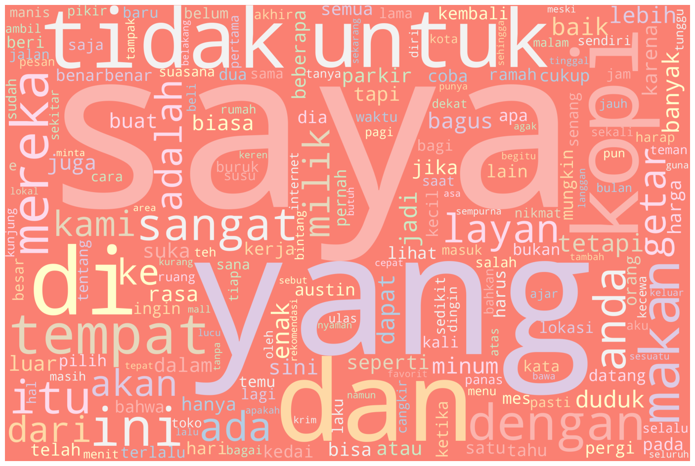

# HangoutYuk Machine Learning Research

This repository contains some research behind HangoutYuk! Machine Learning Model.

## Our ML Model

| Information     | Value                                                                           |
| --------------- | ------------------------------------------------------------------------------- |
| Model Structure | TextVectorization - Embedding - LSTM - Dense(ReLu) - Dense(Sigmoid)             |
| Model Input     | List of strings, uncased (lower string), alphabetic (word only)                 |
| Model Output    | Sigmoid values [0..1] where 0 is negative sentiment and 1 is positive sentiment |

## Dataset Sources

1. [Restaurant Reviews](https://www.kaggle.com/datasets/vigneshwarsofficial/reviews)
2. [Cafe Reviews](https://www.kaggle.com/datasets/sripaadsrinivasan/yelp-coffee-reviews)
3. Google Maps API

## Dataset Visualization

## Our Problems

1. problem 1
2. problem 2

## Our Next Features

1. next feature 1
2. next feature 2

## Our Machine Learning Team Members

| Bangkit ID  | Name                      | University                       | Contact                                                                     |
| ----------- | ------------------------- | -------------------------------- | --------------------------------------------------------------------------- |
| M360DSX3692 | Adri Firmansya Sofyan     | Universitas Telkom               | [Linkedin](https://www.linkedin.com/in/adri-firmansya-sofyan-9215b2271/)    |
| M309DSX0159 | Muhammad Rafi Valliansyah | Universitas Pendidikan Indonesia | [Linkedin](https://www.linkedin.com/in/muhammad-rafi-valliansyah-47677882/) |
| M169DSY2157 | Sania Rizka Ramadhani     | Universitas Gadjah Mada          | [Linkedin](https://www.linkedin.com/in/saniarizka/)                         |

> _So einfach ist es schon, wie kannst du es nicht schaffen?_
